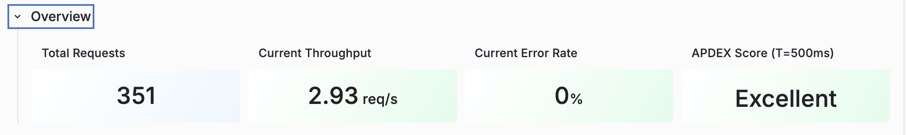
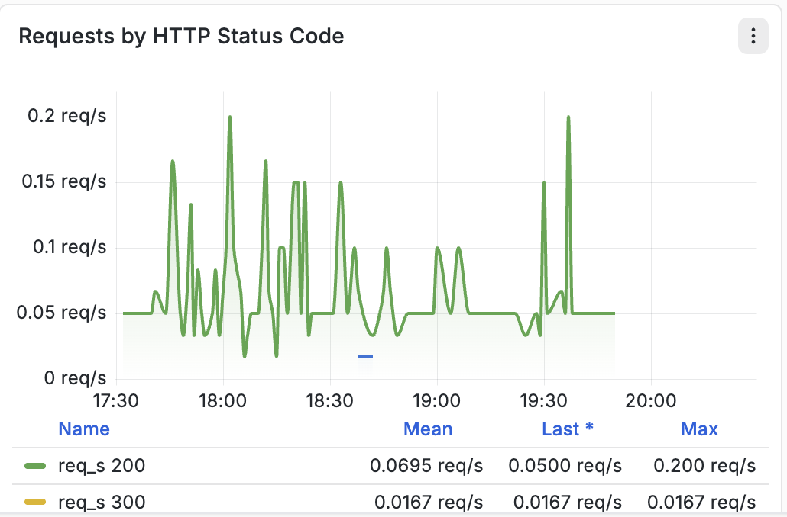
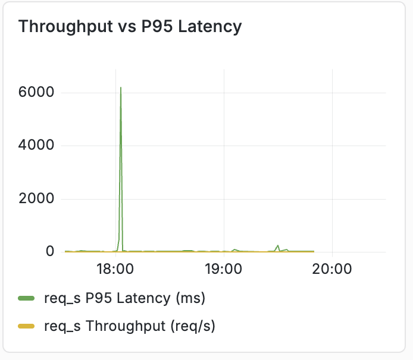
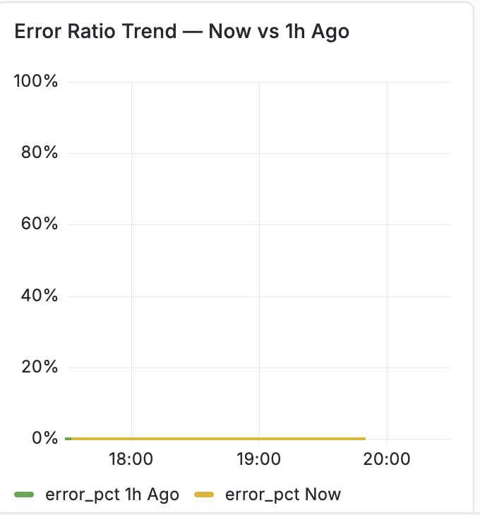

# Synoptryxを使用したアプリケーションパフォーマンス監視（APM） {#application-performance-monitoring}

Synoptryx Application Performance Monitoring （APM）は、Adobe Experience Manager（AEM）のパフォーマンスとエンドユーザーエクスペリエンスにリアルタイムおよび過去のinsightを提供します。 エンドツーエンドのトランザクショントレーシング、チャート、レポートにより、Java コードレベルに至るまでアプリケーションの動作を可視化できます。

## Managed Services Synoptryx APM プラグイン {#apm-plugin}

AEMは、Apache SlingとJackrabbit Oak上に構築されたApache Felix OSGi モジュールを使用して、Jetty上でJava アプリケーションとして実行されます。 Adobe Managed Services、AEM エンジニアリング、Synoptryx Engineeringは、Managed Services環境用のカスタム計装を共同開発しました。

そのインストルメンテーションは次を収集します。

- **意味のあるトランザクションの命名** — Sling拡張機能は、トランザクション名をページ構造に合わせて調整し、インサイトイベントに`requestURL`属性を追加して、ダッシュボード間でSling URLを関連付けることができます。


- **JCR instrumentation** — リポジトリーレベルの操作（XPathおよびJCR-SQL2を含む）が分類され、APMのデータベースセクションのトランザクショントレースに添付されます。


## Synoptryx APMの使用 {#using-apm}

APMを使用して、エンドユーザーに影響を与える前にアプリケーションの問題を見つけます。 オーサーとパブリッシュはコードベースを共有しますが、**個別のAPM アプリケーション**&#x200B;として監視されるので、各階層を個別に分析できます。

Managed Servicesには、次のような機能があります。

- オーサー用の1つのAPM アプリケーション
- パブリッシュ用の1つのAPM アプリケーション

Synoptryx APMでアプリケーション名を選択して、その概要および監視ダッシュボードを開きます。

作成者と公開アプリケーションを表示する

## ダッシュボードのセクション

Application Performance Management ダッシュボードには、次のセクションがあります。

- 概要
- RED指標（レート・エラー・期間）
- トラフィック
- レイテンシとパフォーマンス
- エラーの詳細
- 上位のトランザクション
- JVM Health
- JVM メモリ
- ガベージコレクション

このガイドでは、以下に示すセクションのみを説明します。

## ダッシュボードナビゲーション


ダッシュボードは、関連するアプリケーションパフォーマンス指標をグループ化する拡張可能なセクションに整理されています。 セクションを展開すると、そのカテゴリに関連する1つ以上のグラフが表示されます。

## 概要



### 説明

**概要** セクションには、監視対象アプリケーションの現在の状態を要約した高レベルの主要業績評価指標（KPI）が表示されます。

これらのKPIは、アプリケーションのアクティビティ、スループット、リクエストの成功、全体的なユーザーエクスペリエンスの概要を一目で把握するのに役立ちます。

### 指標

#### 合計要求数

選択した時間範囲内にアプリケーションによって処理されたリクエストの合計数を表示します。

**指標**

```
total_requests
```

**ユニット**

- 回数

#### 現在のスループット

現在のリクエスト処理率を表示します。

**指標**

```
throughput
```

**ユニット**

- 1秒あたりのリクエスト数（req/s）

#### 現在のエラー率

エラーが発生したリクエストの割合を表示します。

**指標**

```
error_rate
```

**ユニット**

- 割合（%）

#### APDEX スコア

アプリケーションの応答時間に基づいてエンドユーザーの満足度を測定する、アプリケーションのパフォーマンス指標（APDEX）を表示します。

設定されたしきい値がウィジェット内に表示されます。

**指標**

```
apdex_score
```

**ユニット**

- スコア （0.0 - 1.0）

## RED Metrics

RED手法は、アプリケーションの3つの主な特徴を測定します。

- **率**
- **エラー**
- **期間**

### リクエスト率


#### 説明

時間の経過に伴って受信されたアプリケーションリクエストの数を表示します。

このグラフは、時系列の可視化を使用したリクエストスループットを表しています。

#### 指標

```
req_min
```

#### 単位

- 1分あたりのリクエスト数（req/m）

#### 表示される情報

- 時系列要求率
- 履歴リクエストアクティビティ
- リクエスト率の傾向
- 指標凡例

### エラー率


#### 説明

エラーが発生したリクエストの割合を表示します。

このグラフは、過去と現在のエラー率を比較したものです。

#### 指標

```
error_pct (now)
error_pct (1h ago)
```

#### 単位

- 割合（%）

#### 表示される情報

- 現在のエラー率
- 履歴の比較
- 平均値
- 時系列傾向

### リクエスト期間


#### 説明

複数の応答時間パーセンタイルにわたるリクエスト待ち時間を表示します。

グラフは、選択した観察期間中に収集されたパーセンタイルの待ち時間の測定値を同時にプロットします。

#### 指標

```
P50
P75
P90
```

#### 購入点数

- ミリ秒（ms）
- 秒

単位は、応答時間に応じて自動的に拡張されます。

#### 表示される統計

パーセンタイルごとに：

- 平均
- 最終
- 最大

#### 百分率の定義

| 指標 | 説明 |
| ------ | ----------------------------- |
| P50 | 50 パーセンタイル応答時間 |
| P75 | 75 パーセンタイル応答時間 |
| P90 | 90 パーセンタイル応答時間 |

## トラフィック

### HTTP ステータスコード別リクエスト



#### 説明

リクエストスループットをHTTP応答ステータスコードでグループ化して表示します。

各ステータスコードは、時間の経過とともに独立してプロットされます。

#### 指標

一般的な指標は次のとおりです。

```
req_s 200
req_s 300
req_s 400
req_s 500
```

依存度を減らすことができます。

#### 単位

- 1秒あたりのリクエスト数（req/s）

#### 表示される情報

- HTTP ステータス別のスループット
- 平均スループット
- 最新のスループット
- 最大スループット
- 時系列アクティビティ

### エンドポイント別リクエストレート


#### 説明

トラフィックが最も多いアプリケーションエンドポイントを、リクエスト率でランク付けして表示します。

各エンドポイントは、リクエストボリュームを表す水平バーとして表示されます。

#### 指標

```
endpoint_request_rate
```

#### 単位

- 1分あたりのリクエスト数（req/m）

#### 表示される情報

- エンドポイントパス
- リクエスト率
- ランクエンドポイントリスト
- 相対的なリクエスト量

## レイテンシとパフォーマンス

### 応答時間 – P95対1時間


#### 説明

現在のP95応答時間と、1時間前に記録されたP95応答時間との比較を表示します。

両方のデータセットは、同じ時系列グラフに表示されます。

#### 指標

```
P95 (Current)
P95 (1 Hour Ago)
```

#### 購入点数

- ミリ秒（ms）
- 秒

#### 表示される統計

- 平均
- 最終
- 最大

### APDEX スコアの推移


#### 説明

アプリケーションのパフォーマンス指標を連続時系列で表示します。

グラフは、選択したモニタリング間隔を通してAPDEX値を視覚化します。

#### 指標

```
APDEX Score
```

#### 単位

- スコア （0.0 ～ 1.0）

#### 表示される統計

- 平均
- 最終
- 最大

### スループットとP95待ち時間の比較



#### 説明

同じタイムラインに、リクエストスループットとP95応答レイテンシを表示します。

このグラフにより、トラフィック量と応答待ち時間を同時に可視化できます。

#### 指標

```
Throughput
P95 Latency
```

#### 購入点数

| 指標 | 単位 |
| ----------- | ------------ |
| スループット | リクエスト/秒 |
| P95待ち時間 | ミリ秒 |

#### 表示される情報

- 時系列スループット
- 時系列待ち時間
- デュアル指標の比較

## エラーの詳細

### ステータスグループ別のエラー率%


#### 説明

アプリケーションエラーの割合をHTTP応答クラスでグループ化して表示します。

応答カテゴリごとに別々の系列がプロットされます。

#### 指標

一般的なグループは、次のとおりです。

```
2xx
3xx
4xx
5xx
Combined Error Trend
```

トラフィックの大きさに応じて。

#### 単位

- 割合（%）

#### 表示される情報

- 応答クラス別のエラー率
- 平均失敗率
- 時系列傾向


### エラー率の傾向：1時間前と現在の比較



#### 説明

現在のアプリケーションのエラー率と、1時間前に記録されたエラー率を表示します。

#### 指標

```
Current Error Ratio
1 Hour Error Ratio
```

#### 単位

- 割合（%）

#### 表示される情報

- 現在のトレンド
- 履歴の比較
- 時系列の可視化

### エラー率のトレンド：現在と6時間前の比較


#### 説明

現在のアプリケーションのエラー率と、6時間前に記録されたエラー率を表示します。

#### 指標

```
Current Error Ratio
6 Hour Error Ratio
```

#### 単位

- 割合（%）

#### 表示される情報

- 現在のエラー比率
- 履歴の比較
- 時系列の可視化

## ダッシュボード指標の概要

| ダッシュボード | プライマリ指標 |
| -------------------------- | --------------------------------------------- |
| 概要 | リクエストの合計数、スループット、エラー率、APDEX |
| リクエスト率 | リクエスト/分 |
| エラー率 | エラー率 |
| リクエスト期間 | P50、P75、P90待ち時間 |
| ステータスコード別リクエスト | HTTP ステータスススループット |
| エンドポイント別リクエストレート | エンドポイント要求ボリューム |
| 応答時間の比較 | 現在のP95と過去のP95 |
| APDEX スコア | ユーザー満足度指数 |
| スループットとレイテンシの違い | リクエストスループットとP95待ち時間 |
| ステータスグループ別のエラー率 | HTTP ステータスグループエラー率 |
| エラー比率のトレンド | 現在と過去のエラーの比率 |
