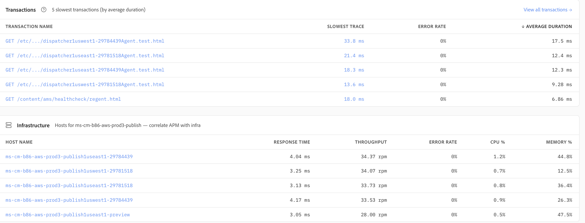

# Applications

アプリケーションは、アプリケーションパフォーマンス監視（APM）機能を提供し、各サービスをサポートするアプリケーションの健全性、パフォーマンス、トランザクション、および基盤となるインフラストラクチャの統一されたビューを提供します。 運用チームやエンジニアリングチームは、アプリケーションの行動を把握し、パフォーマンスのボトルネックを特定できます。また、健全性に関する高い指標から個々のトランザクションに移行し、より詳細な調査を実施できます。

## アプリケーションの概要

**アプリケーション**&#x200B;の概要では、選択したアプリケーションの概要を一目で確認できます。 p95待ち時間、サーバースループット、エラー率、Apdexなどの主要指標により、選択した時間範囲におけるアプリケーションの健全性を簡単に評価できます。

トランザクションタイプ、ホスト、解像度のフィルターを使用すると、特定の調査のためにビューを絞り込むことができます。 レスポンスタイムとスループットの傾向によって新たなコンテキストが得られ、独立したスパイクと持続的なパフォーマンス変化を区別するのに役立ちます。

## レスポンスタイム、スループット、Apdex

アプリケーションパフォーマンスは、リクエストスループットと並行してパーセンタイル応答時間を使用して評価できます。 p50、p95、およびp99の待ち時間を一緒に表示すると、一般的なユーザーエクスペリエンスと遅い外れ値を区別できます。

Apdexは、応答時間のパフォーマンスをわかりやすい満足度スコアに変換することで、アプリケーションの応答性を補完的に測定します。 これらの指標は、エラー率と共に、アプリケーションが期待されるパフォーマンスレベル内で動作しているかどうかを簡潔に示します。

## エラーと低速なトランザクション

アプリケーションは、エラー率の傾向と時間のかかるトランザクションを継続的に明らかにし、アプリケーションのパフォーマンスに影響を与える可能性のあるリクエストを特定するのに役立ちます。 エラー率ビューでは、時間の経過による変化を簡単に認識できます。Apdexのトレンドは、対応するアプリケーションの応答性への影響を示しています。

**最も遅いトランザクション**&#x200B;のビューでは、平均期間が最も長いトランザクションがハイライト表示され、呼び出し量が含まれているため、頻繁に実行されるワークロードを個別の低速リクエストと区別しやすくなります。

## トランザクションとインフラの相関関係

トランザクションリストでは、最も遅いトランザクションタイプ（最も遅い観察トレース、エラー率、平均期間など）を焦点を当てて表示します。 これにより、さらなる調査が必要なトランザクションパターンを迅速に特定できます。

アプリケーションデータは基盤となるホストと関連付けられているため、トランザクションパフォーマンスは、応答時間、スループット、CPU使用率、メモリ使用率などのインフラストラクチャ指標と並行して評価できます。 この相関関係は、パフォーマンスの問題がアプリケーション処理に起因するか、サポートするインフラストラクチャに関連付けられているかどうかを判断するのに役立ちます。

## トランザクションパフォーマンス分析

トランザクション分析ビューでは、パフォーマンス特性ごとにトランザクションをランク付けし、最も時間のかかるトランザクション、最も遅いp95応答時間、最も高いエラー率、スループット、Apdexなどの主要指標を要約します。

時系列のビジュアライゼーションは、最も重要なトランザクションが全体的な処理時間にどのように貢献しているか、および選択した期間におけるリクエストスループットの変化を示します。 これにより、効果の高いエンドポイントを特定し、トランザクション行動を比較し、最初に調査するリクエストを決定することが容易になります。

## パフォーマンスの問題の調査

アプリケーションは、プログレッシブ調査ワークフローをサポートします。まず、アプリケーションレベルの正常性およびパフォーマンス指標から始め、異常な応答時間、エラー、またはスループットの変更を特定し、次に、問題に最も貢献するトランザクションに調査を絞り込みます。 トランザクションデータは、ホストレベルのインフラストラクチャ指標と関連付けることができます。

このワークフローは、ホスト **のトランザクションの** アプリケーションの正常性→パフォーマンスの傾向から効率的→移動す→のに役立ち、パフォーマンスの問題の原因を特定するために必要な時間を短縮します。
