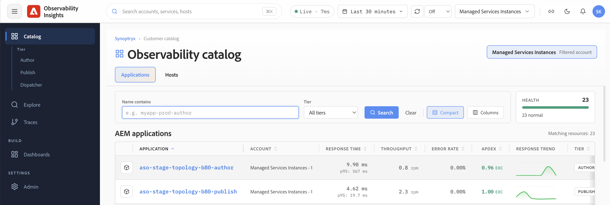

# オブザーバビリティインサイトの基本を学ぶ {#get-started}

この節では、新しいユーザーに必要な情報について説明します。Observability Insights アカウントにアクセスする方法、Adobeが代わりにモニタリングする環境とデータ、および残りのドキュメントを操作する方法です。

## Observability Insights インターフェイス {#observability-insights-interface}

[insights.adobecqms.net](https://insights.adobecqms.net)でログインすると、開く画面で、AEM Managed Services環境のすべての監視領域に入ります。

このインターフェイスは、次の2つの監視領域を中心に構成されています。

- **アプリケーション** – 作成者およびパブリッシュ層のアプリケーションのパフォーマンスデータを表示します。 これを使用して、リクエストスループット、エラー率、レイテンシ、JVM動作、およびトレースレベルの実行の詳細を調査します。 [&#x200B; アプリケーション &#x200B;](../applications.md)を参照してください。
- **Hosts** – 管理対象トポロジ全体のホストレベルの正常性データを表示します。 これを使用して、個々のサーバー上のCPU、メモリ、ディスク、ネットワーク、およびストレージの信号を評価します。 [&#x200B; ホスト &#x200B;](../hosts.md)を参照してください。

両方の領域は、顧客ユーザーに対して読み取り専用です。 Adobe Managed Servicesは、アカウントのプロビジョニング、インストルメント化、管理制御を管理します。

## アクセスとアカウント管理 {#access-overview}

オブザーバビリティ インサイトへのアクセスは、Adobe IMSを通じて管理されます。 Adobeは、組織のアカウントをプロビジョニングおよび管理します。お客様のチームは、監視対象のすべてのデータに対する読み取り専用アクセスを受け取ります。

重要なポイント：

- 組織のObservability Insights アカウントは、1つのAdobe マスターアカウントにリンクされています。
- Managed Services コントラクト内のすべての環境（オーサー環境とパブリッシュ環境、実稼動環境および非実稼動環境）がこのアカウントにレポートされます。
- ユーザーアクセスは、カスタマーサクセスエンジニア（CSE）によってプロビジョニングおよび管理されます。

プロビジョニング手順、ユーザーの役割、および顧客ユーザーが実行できる操作と実行できない操作については、[&#x200B; アクセスとアカウントの管理](access-and-accounts.md)を参照してください。

## カバレッジ、環境、データ保持 {#coverage-overview}

Adobeは、Observability Insights APM Java プラグインを使用してAEM オーサー層とパブリッシュ層をモニタリングし、Observability Insights Infrastructure エージェントを使用してホストされているすべてのサーバーをモニタリングします。 監視は、実稼動以外の環境と実稼動環境の両方で有効になります。

重要なポイント：

- 各AEM Managed Services環境には、オーサー用の1つのAPM アプリケーションとパブリッシュ用の1つのAPM アプリケーションが含まれています。
- APM指標、インフラストラクチャ指標、およびイベントは、最大&#x200B;**30日間**&#x200B;保持されます。
- Observability Insightsは、運用分析や最近のトレンド比較に適しており、アーカイブや長期的なレポートツールではありません。 データが古くなる前に、スクリーンショットを撮影したり、証拠を書き出したりできます。

アカウント内でのアプリケーションの表示方法やリテンションウィンドウの運用上の影響など、完全なカバレッジの詳細については、[&#x200B; カバレッジ、環境、データ保持](coverage-and-data.md)を参照してください。

## このガイドの内容 {#how-this-guide-is-structured}

このドキュメントは、4つの領域に分かれています。 以下の説明を使用して、必要な内容に直接移動します。

**基本を学ぶ** – このセクション。 アクセス、アカウントのプロビジョニング、監視範囲、データ保持について説明します。

**[オブザーバビリティ インサイトを使用](../use-observability-insights.md)** – 日常調査のためのタスク指向ガイダンス。 症状がアプリケーションに対応している場合は、[&#x200B; アプリケーション &#x200B;](../applications.md)を使用します。遅いページ、エラースパイク、または不安定なトランザクションです。 ホスト レベルのリソースのプレッシャー（CPU、メモリ、ディスク、またはネットワーク）がアプリケーションで表示される内容を説明しているかどうかを判断する必要がある場合は、[&#x200B; ホスト &#x200B;](../hosts.md)を使用します。 ステップバイステップの調査フローは、[&#x200B; アプリケーションの問題の調査](../use-cases/investigate-application-issues.md)および[&#x200B; インフラストラクチャの問題の調査](../use-cases/investigate-infrastructure-issues.md)で利用できます。

**[よくある質問](../troubleshooting/common-questions.md)** — アクティブなインシデントの際に、どこから始めればよいかわからなかったり、迅速な回答が必要な場合の、よくある質問とサポート指向のエントリポイント。
